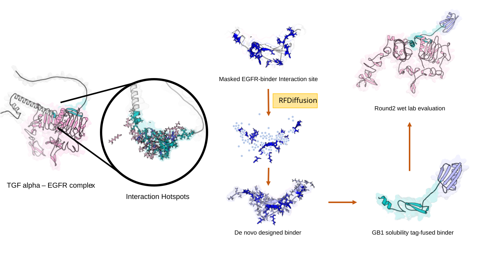

# EGF Binders: Round 2 of Adaptyv Bio's Protein Design Competition

**AmirMohammad (@a.m.m.h2003)**

Adaptyv Bio accepted submissions for Round 2 of their Protein Design Competition.  
I designed *20* binders targeting **Epidermal Growth Factor (EGF)**; **6** were selected after in‑silico filters and proceeded to **wet‑lab evaluation**.

<p align="center">
  
</p>

> This repository collects the design notes, figures, and minimal code used to generate the analyses.
> All sequences and data produced by me are included or linked; third‑party datasets are referenced where applicable.

## TL;DR
- Target: EGF (ligand of EGFR).
- Designs submitted: 20; chosen for wet‑lab: 6.
- Wet‑lab readout: BLI/kinetic curves (association–dissociation, shift in nm).  
- Goal: Share a concise, reproducible snapshot of the pipeline and results.

## Methods (brief)
1. **Target prep** – EGF structure and interface context with EGFR DIII for hotspot guidance.
2. **Sequence generation** – multiple independent seeds; length and secondary‑structure constraints varied.
3. **In‑silico filters** – structural confidence and interface quality; basic developability screens (e.g., charge, hydrophobics, motifs).
4. **Complex modeling** – binder:EGF models; interface sanity checks and contact maps.
5. **Down‑selection** – top 6 forwarded for wet‑lab.
6. **Wet‑lab** – BLI runs at several concentrations; global fitting of association/dissociation to estimate k_on, k_off, and K_D.

> Notes: exact tools and parameters are listed in the `analysis/` folder or inline in figures. Replace/expand the bullets with your true pipeline details.

## Results (snapshot)
- 6 designs showed clear association plateaus and measurable dissociation.  
- Representative traces are in `./figs`. If available, a table of fitted **k_on**, **k_off**, **K_D** values can be added in `results/kinetics_summary.csv`.

## Repository layout
```
egf-binders-adaptyv-round2/
├─ README.md
├─ figs/
│  └─ kinetics.png            # provided figure
├─ sequences/                 # place FASTA files here (e.g., submitted_20.fasta, selected_6.fasta)
├─ results/                   # e.g., kinetics_summary.csv, raw_export/
├─ analysis/                  # scripts/notebooks used for plots and filtering
├─ LICENSE
└─ .gitignore
```

## Reproduce / reuse
- Figures are pre‑rendered for quick viewing.
- If you add code: include minimal instructions in `analysis/` (environment and a run command).

## Acknowledgments
Adaptyv Bio for organizing the competition. Thanks to the community for sharing methods and feedback.

---

> **How to cite:** If you use any of these figures, please cite this repository (author: AmirMohammad) and the corresponding competition round.

